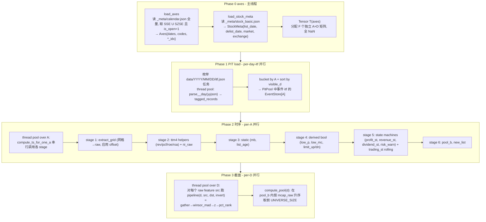

## 命名空间与目录

新增 `feature::` 子系统, 与现有 `tushare::` 对仗 (一进一出: tushare 进数据, feature 出张量). 全部头文件在 `cpp/include/feature/`, 实现在 `cpp/src/feature/`. 8 个文件, 按 phase 分:

```
cpp/include/feature/
  axis.hpp        # Phase 0 输入: D/A 轴 + asset-static meta
  feature.hpp     # F 枚举 + FeatureMeta 静态表 (kind/axis)
  tensor.hpp      # Tensor 容器 (uniform [F][A][D] layout)
  pit.hpp         # PIT 中间结构 (per-itf POD record + 存储)
  load.hpp        # Phase 1 入口
  ts.hpp          # Phase 2 入口
  cs.hpp          # Phase 3 入口
  build.hpp       # 编排入口 feature::build() → Tensor

cpp/src/feature/
  axis.cpp        # load_axes / load_stock_meta
  feature.cpp     # FEATURES 表
  tensor.cpp      # Tensor 构造 / slice / at()
  pit.cpp         # 各 itf 的 parse_*_record 实现
  load.cpp        # 并行 load_pit
  ts.cpp          # compute_ts: per-A worker + 各 stage 函数
  cs.cpp          # compute_cs: per-D pipeline + pool
  build.cpp       # build() 串 4 phase
```

主入口接到 `cpp/src/main.cpp`:
- `tushare::update(...)` → `feature::Tensor T = feature::build();` → (后续 signal/strategy 复用 T)

CMake `cpp/projects/main/CMakeLists.txt` 的 SOURCES/HEADERS 列表追加 8 个 .cpp + 8 个 .hpp.

---

## 4-Phase 流水线



---

## 关键数据结构 (头文件骨架)

[cpp/include/feature/axis.hpp](cpp/include/feature/axis.hpp)
```cpp
namespace feature {
struct Axes {
  std::vector<std::string> dates;   // YYYYMMDD, 升序, 仅 SSE U SZSE 交易日
  std::vector<std::string> codes;   // ts_code, 升序 (含已退市)
  std::unordered_map<std::string,int> date_idx;
  std::unordered_map<std::string,int> code_idx;
  int n_d() const; int n_a() const;
  int floor_date(std::string_view d) const;  // max{i: dates[i] <= d}, 找不到 -1
};
struct StockMeta {  // per-A asset 静态, 与 Axes.codes 同序
  std::vector<std::string> list_date, delist_date, market, exchange;
};
Axes load_axes();
StockMeta load_stock_meta(const Axes&);
}
```

[cpp/include/feature/feature.hpp](cpp/include/feature/feature.hpp)
```cpp
namespace feature {
enum class F : int {
  // filter
  profit_st, revenue_st, dividend_st, trading_st, risk_warn, new_list,
  // feature (截面输出)
  close, mcap, fmcap, pe_ttm4, pb_ttm1, ps_ttm4, pcf_ttm4, roe_ttm4, roa_ttm4, dy_ttm4,
  // inter (中间, 时序)
  close_raw, up_lim, dn_lim, susp, mcap_raw, fmcap_raw, share_raw,
  pe_raw, pb_raw, ps_raw, dy_raw, pcf_raw, roe_raw, roa_raw, rev_raw, ni_raw,
  mb, list_age, low_p, low_mc, limit_up, limit_dn, pool_b, pool,
  COUNT
};
enum class Kind : uint8_t { Filter, Feature, Inter };
enum class Axis : uint8_t { TimeSeries, CrossSection };
struct FeatureMeta { const char* name; Kind kind; Axis axis; };
extern const std::array<FeatureMeta, (size_t)F::COUNT> FEATURES;
}
```

[cpp/include/feature/tensor.hpp](cpp/include/feature/tensor.hpp) — 统一 [F][A][D] layout, 每 feature 一段连续 A*D, NaN 初始化
```cpp
namespace feature {
struct Tensor {
  const Axes& axes;
  std::vector<std::vector<float>> mats;  // [F] outer, 每段长度 A*D, row-major (a-major, d-minor)
  explicit Tensor(const Axes&);
  // 时序 行 (length D, 连续) — Phase 2 主路径
  std::span<float>       ts_row(F f, int a);
  std::span<const float> ts_row(F f, int a) const;
  // 截面 行 (length A, stride D, gather) — Phase 3 入口处一次性 copy 到栈 buffer
  void gather_cs_row(F f, int d, std::span<float> out) const;
  void scatter_cs_row(F f, int d, std::span<const float> in);
  // 单元
  float  at(F f, int a, int d) const;
  float& at(F f, int a, int d);
};
}
```

[cpp/include/feature/pit.hpp](cpp/include/feature/pit.hpp)
```cpp
namespace feature {
// 网格 (1 record / D / A): 直接 dense 存
// 用 NaN 标记缺席, 每个字段独立向量, 长度 D*A (a-major 与 Tensor 对齐)
struct GridDailyBasic { std::vector<float> close, total_mv, circ_mv, total_share, pe_ttm, pb, ps_ttm, dv_ttm; };
struct GridStkLimit   { std::vector<float> up_limit, down_limit; };
struct GridSuspendD   { std::vector<uint8_t> susp; };  // 0/1
// adj_factor 暂未进 FEATURES, 预留口子

// 事件 (per A 时间线, 按 visible_d_idx 升序)
struct ForecastEv  { int v; std::string end_date, type; float last_parent_net; };
struct ReportEv    { int v; std::string end_date; };
struct STEv        { int v; std::string st_name; };
struct DividendEv  { int v; std::string end_date, div_proc; float cash_div_tax; };
struct IncomeEv    { int v; std::string end_date, report_type; float revenue, n_income_attr_p; };
struct CashflowEv  { int v; std::string end_date, report_type; float n_cashflow_act; };
struct FinaIndEv   { int v; std::string end_date; float roe, roa; };
template <class Ev> using EventStore = std::vector<std::vector<Ev>>;  // [A] 外, 每 A 一条按 v 升序的链

struct PitPool {
  GridDailyBasic daily_basic;
  GridStkLimit   stk_limit;
  GridSuspendD   suspend_d;
  EventStore<ForecastEv>  forecast;
  EventStore<ReportEv>    report;
  EventStore<STEv>        st;
  EventStore<DividendEv>  dividend;
  EventStore<IncomeEv>    income;
  EventStore<CashflowEv>  cashflow;
  EventStore<FinaIndEv>   fina_indicator;
  // disclosure 当前 FEATURES 未用, 不入 pool (将来需要再加)
};
}
```

[cpp/include/feature/load.hpp](cpp/include/feature/load.hpp)
```cpp
namespace feature {
// Phase 1: 扫 data/YYYY/MM/DD/, 并行解析所有 (day, itf) 文件 → PitPool
// 网格 itf 直接写 dense slot (按 visible_d_idx 唯一, 无锁); 事件 itf 走 per-A 锁 emplace + 末段 sort
void load_pit(const Axes&, PitPool&);
}
```

[cpp/include/feature/ts.hpp](cpp/include/feature/ts.hpp)
```cpp
namespace feature {
// Phase 2: per-A 并行 (线程池), 每 A 串行跑 stage 1..6
void compute_ts(const Axes&, const PitPool&, const StockMeta&, Tensor&);
}
```

[cpp/include/feature/cs.hpp](cpp/include/feature/cs.hpp)
```cpp
namespace feature {
// Phase 3: per-D 并行 (线程池), 跑 10 个 raw→feature pipeline + pool
void compute_cs(const Axes&, Tensor&);
}
```

[cpp/include/feature/build.hpp](cpp/include/feature/build.hpp)
```cpp
namespace feature {
Tensor build();  // axes → load → ts → cs, 内部用 misc::Timer 报时
}
```

---

## 内部抽象 (.cpp 内 helper, 不出头文件)

`load.cpp`
- `for_each_data_day(callback)` — 枚举所有 `data/YYYY/MM/DD/` 路径, 给到 thread pool
- 每 itf 一个 `parse_<itf>_day(yyjson_val* arr, int v_idx, ...)` 写网格 / 追事件
- 事件 itf 用 `std::vector<std::mutex> per_a_mu(A)`; 末尾 `for a: std::sort(events[a].begin(), events[a].end(), by v)`

`ts.cpp` (per-A worker, 各 stage 都是 `void stage_xxx(int a, const Axes&, const PitPool&, Tensor&)`)
- helper: `forward_fill_event_to_grid(events, a, T_axis, write_fn)` — 对事件链按 v 升序扫, 用 `floor_date(v + offset)` 写入 row D, 后续 D 沿用最新值直至下一事件
- helper: `ttm4_ytd(income_events, value_field) → per-D float series` — 按 README 公式 `X(t) + X(Y-1, 12) - X(Y-1, t.M)`
- helper: `state_machine(events, a, on_trigger, on_terminate) → per-D bool` — 通用状态机骨架, profit_st / revenue_st / risk_warn 复用

`cs.cpp`
- helper: `pipeline(int d, F src, F dst, bool invert, Tensor&)` — gather row → winsor_mad → z → pct_rank → scatter
- helper: `winsor_mad(span<float>, k=3.0)`, `z(span<float>)`, `pct_rank(span<float>)` — pure 函数, 跳 NaN
- `compute_pool(int d, int universe_size, Tensor&)` — pool_b ∧ rank(mcap_raw asc) ≤ N

---

## 并发模型

- 复用现有 `misc::Affinity::core_count()` 决定线程池大小; `misc::ParallelProgress` 渲染 4 个 phase 的进度
- Phase 1: 任务粒度 = (day, itf). ~3650 day × 14 itf ≈ 50k 任务, 线程池消费
- Phase 2: 任务粒度 = a (~5500). 每 worker 处理 A/N 个 stock, 内部串行调 stage 1..6
- Phase 3: 任务粒度 = d (~2750). 每 worker 处理 D/N 个 trade-day, 内部按 10 个截面特征串行
- 同步点: phase 之间硬屏障 (build.cpp 内顺序 join), phase 内无写冲突 (Phase 2 每 a 写自己的 ts_row, Phase 3 每 d 写自己的 cs_row 段)

---

## 不在本期范围

- 张量落盘 / mmap (用户选 in-memory only)
- adj_factor → close 复权重算 (FEATURES 当前用 close_raw 直取, 未涉及; 留 GridAdjFactor 口子)
- disclosure itf (无 feature 依赖)
- signal / strategy 引擎 (Phase 4, 后续单开)